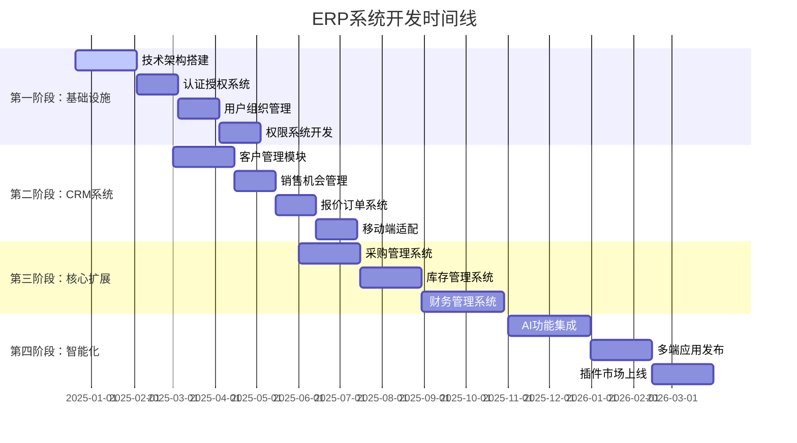

# ERP 系统开发路线图

## 目录
1. [项目概述](#1-项目概述)
2. [开发阶段规划](#2-开发阶段规划)
3. [详细里程碑](#3-详细里程碑)
4. [技术债务管理](#4-技术债务管理)
5. [质量保证计划](#5-质量保证计划)
6. [风险管控策略](#6-风险管控策略)
7. [团队资源规划](#7-团队资源规划)
8. [成功指标](#8-成功指标)

---

## 1. 项目概述

### 1.1 项目愿景
构建一个颠覆性用户体验的模块化 ERP 系统，成为中小企业数字化转型的首选解决方案。

### 1.2 核心目标
- **6个月**：完整 CRM 系统上线
- **12个月**：核心业务模块完成（采购、库存、财务）
- **18个月**：AI 智能化和多端应用全面发布
- **24个月**：插件生态建成，实现商业化盈利

### 1.3 关键成功因素
```
成功要素优先级：
1. 用户体验 (40%) - 直观性、即时反馈、流程化
2. 产品稳定性 (25%) - 可用性、性能、安全性
3. 功能完整性 (20%) - 核心业务覆盖度
4. 技术先进性 (15%) - 架构可扩展性、AI集成
```

---

## 2. 开发阶段规划

### 2.1 四大开发阶段



### 2.2 版本发布计划

```typescript
// 版本发布时间线
interface ReleaseSchedule {
  v0_1_0: {
    name: "Alpha 内测版";
    date: "2025-02-15";
    features: ["基础认证", "用户管理", "组织架构"];
    target: "内部团队测试";
  };

  v0_5_0: {
    name: "Beta 公测版";
    date: "2025-05-15";
    features: ["完整CRM", "移动端", "基础报表"];
    target: "种子客户测试";
  };

  v1_0_0: {
    name: "正式发布版";
    date: "2025-08-15";
    features: ["CRM+采购+库存", "多租户", "API开放"];
    target: "正式商用";
  };

  v1_5_0: {
    name: "增强版";
    date: "2025-11-15";
    features: ["财务模块", "高级报表", "工作流"];
    target: "企业级客户";
  };

  v2_0_0: {
    name: "智能版";
    date: "2026-02-15";
    features: ["AI集成", "小程序", "插件市场"];
    target: "全功能商用";
  };
}
```

---

## 3. 详细里程碑

### 3.1 第一阶段：基础设施建设 (2024.12 - 2025.03)

#### Week 1-4: 项目初始化 ✅
```bash
里程碑 M1.1 - 项目启动 (2024-12-20)
├── ✅ 产品需求分析和设计
├── ✅ 技术架构设计
├── ✅ 数据库设计
├── ✅ API 规范制定
├── ✅ 项目结构搭建
└── ✅ 开发环境配置
```

#### Week 5-8: 核心基础服务
```bash
里程碑 M1.2 - 基础服务 (2025-01-17)
├── 🔄 Go Kratos 微服务框架搭建
├── 🔄 PostgreSQL 数据库初始化
├── 🔄 Redis 缓存服务配置
├── 🔄 Docker 容器化环境
├── 🔄 API 网关服务
└── 🔄 基础监控和日志系统
```

#### Week 9-12: 认证授权系统
```bash
里程碑 M1.3 - 认证授权 (2025-02-14)
├── 📋 JWT 认证机制
├── 📋 多租户数据隔离
├── 📋 RBAC 权限系统
├── 📋 用户注册登录
├── 📋 密码安全策略
└── 📋 二因素认证
```

#### Week 13-16: 用户组织管理
```bash
里程碑 M1.4 - 用户管理 (2025-03-14)
├── 📋 用户信息管理
├── 📋 组织架构管理
├── 📋 角色权限分配
├── 📋 用户画像系统
├── 📋 批量操作功能
└── 📋 审计日志记录
```

### 3.2 第二阶段：CRM 系统开发 (2025.03 - 2025.06)

#### Month 1: 客户管理核心
```bash
里程碑 M2.1 - 客户管理 (2025-04-15)
├── 📋 客户基础信息管理
├── 📋 客户分类和标签
├── 📋 联系人管理
├── 📋 客户搜索和筛选
├── 📋 客户导入导出
├── 📋 客户数据统计
└── 📋 移动端客户查看
```

#### Month 2: 销售机会管理
```bash
里程碑 M2.2 - 销售机会 (2025-05-15)
├── 📋 销售漏斗管理
├── 📋 机会阶段跟踪
├── 📋 销售预测分析
├── 📋 竞争对手分析
├── 📋 销售活动记录
├── 📋 团队协作功能
└── 📋 移动端机会管理
```

#### Month 3: 报价订单系统
```bash
里程碑 M2.3 - 报价订单 (2025-06-15)
├── 📋 产品目录管理
├── 📋 价格策略配置
├── 📋 报价单生成
├── 📋 订单创建流程
├── 📋 审批工作流
├── 📋 合同管理
└── 📋 订单执行跟踪
```

### 3.3 第三阶段：核心业务模块 (2025.06 - 2025.11)

#### Month 1-2: 采购管理系统
```bash
里程碑 M3.1 - 采购管理 (2025-08-15)
├── 📋 供应商管理
├── 📋 采购申请流程
├── 📋 询价比价系统
├── 📋 采购订单管理
├── 📋 收货验收流程
├── 📋 供应商评估
├── 📋 采购数据分析
└── 📋 移动端采购审批
```

#### Month 3-4: 库存管理系统
```bash
里程碑 M3.2 - 库存管理 (2025-09-15)
├── 📋 多仓库管理
├── 📋 库存实时监控
├── 📋 入库出库流程
├── 📋 库存盘点系统
├── 📋 批次序列号追踪
├── 📋 库存预警机制
├── 📋 库存调拨管理
└── 📋 移动端库存查询
```

#### Month 5-6: 财务管理系统
```bash
里程碑 M3.3 - 财务管理 (2025-11-15)
├── 📋 总账管理系统
├── 📋 应收应付管理
├── 📋 费用报销流程
├── 📋 发票管理系统
├── 📋 财务报表生成
├── 📋 成本核算分析
├── 📋 预算管理
└── 📋 财务数据可视化
```

### 3.4 第四阶段：智能化与生态 (2025.11 - 2026.05)

#### Month 1-2: AI 功能集成
```bash
里程碑 M4.1 - AI 智能化 (2026-01-15)
├── 📋 智能客服机器人
├── 📋 销售预测分析
├── 📋 智能推荐系统
├── 📋 自动化工作流
├── 📋 智能数据分析
├── 📋 语音识别功能
├── 📋 OCR 文档识别
└── 📋 AI 决策支持
```

#### Month 3-4: 多端应用发布
```bash
里程碑 M4.2 - 多端应用 (2026-03-15)
├── 📋 微信小程序发布
├── 📋 React Native App
├── 📋 钉钉企业应用
├── 📋 Electron 桌面端
├── 📋 PWA 渐进应用
├── 📋 响应式Web优化
├── 📋 跨端数据同步
└── 📋 离线功能支持
```

#### Month 5-6: 插件生态建设
```bash
里程碑 M4.3 - 插件生态 (2026-05-15)
├── 📋 插件开发框架
├── 📋 插件市场平台
├── 📋 第三方集成API
├── 📋 开发者工具包
├── 📋 插件审核机制
├── 📋 收益分成体系
├── 📋 开发者社区
└── 📋 插件运营支持
```

---

## 4. 技术债务管理

### 4.1 技术债务识别

```typescript
// 技术债务分类和管理
interface TechnicalDebt {
  // 代码质量债务
  code_quality: {
    complexity: "函数复杂度过高";
    duplication: "代码重复率超标";
    coverage: "测试覆盖率不足";
    documentation: "文档缺失或过期";
  };

  // 架构债务
  architecture: {
    coupling: "模块间耦合度过高";
    scalability: "扩展性设计不足";
    performance: "性能瓶颈未优化";
    security: "安全漏洞未修复";
  };

  // 基础设施债务
  infrastructure: {
    monitoring: "监控覆盖不全";
    automation: "手动操作过多";
    deployment: "部署流程复杂";
    backup: "备份策略不完善";
  };
}

// 债务处理策略
const debtManagementStrategy = {
  high_priority: "影响用户体验或安全，立即修复",
  medium_priority: "影响开发效率，下个迭代修复",
  low_priority: "影响维护性，技术债务专项修复",

  allocation: {
    feature_development: "70%", // 功能开发
    debt_reduction: "20%",      // 债务清理
    innovation: "10%"           // 技术创新
  }
};
```

### 4.2 代码质量保证

```bash
# 代码质量检查流程
code_quality_gates() {
  # 1. 静态代码分析
  echo "Running static code analysis..."

  # Go 代码检查
  golangci-lint run ./...
  go vet ./...

  # TypeScript 代码检查
  npm run lint
  npm run type-check

  # 2. 测试覆盖率检查
  echo "Checking test coverage..."

  # 后端测试覆盖率 (目标 >80%)
  go test -race -coverprofile=coverage.out ./...
  go tool cover -func=coverage.out

  # 前端测试覆盖率 (目标 >75%)
  npm run test:coverage

  # 3. 安全漏洞扫描
  echo "Scanning for security vulnerabilities..."

  # Go 安全扫描
  gosec ./...

  # npm 依赖安全检查
  npm audit

  # 4. 性能测试
  echo "Running performance tests..."

  # API 性能测试
  k6 run performance-tests/api-load-test.js

  # 前端性能测试
  npm run test:lighthouse
}
```

---

## 5. 质量保证计划

### 5.1 测试策略

```typescript
// 测试金字塔策略
interface TestingStrategy {
  // 单元测试 (70%)
  unit_tests: {
    coverage_target: "85%";
    frameworks: ["Go testing", "Jest", "React Testing Library"];
    scope: "函数、方法、组件级别";
    automation: "每次提交自动运行";
  };

  // 集成测试 (20%)
  integration_tests: {
    coverage_target: "主要业务流程100%";
    frameworks: ["Testify", "Cypress", "Playwright"];
    scope: "服务间接口、数据库交互";
    automation: "每日构建时运行";
  };

  // 端到端测试 (10%)
  e2e_tests: {
    coverage_target: "核心用户场景100%";
    frameworks: ["Playwright", "Cypress"];
    scope: "完整用户工作流";
    automation: "发布前运行";
  };
}

// 测试环境管理
const testEnvironments = {
  development: {
    purpose: "开发者本地测试",
    data: "模拟数据",
    refresh: "每次代码变更"
  },

  staging: {
    purpose: "集成测试和用户验收",
    data: "生产数据副本",
    refresh: "每日刷新"
  },

  performance: {
    purpose: "性能和负载测试",
    data: "大量模拟数据",
    refresh: "按需刷新"
  }
};
```

### 5.2 质量度量指标

```typescript
// 质量度量仪表板
interface QualityMetrics {
  // 代码质量指标
  code_quality: {
    test_coverage: number;        // 测试覆盖率 >85%
    code_complexity: number;      // 圈复杂度 <10
    duplication_rate: number;     // 重复率 <3%
    technical_debt_ratio: number; // 技术债务比 <5%
  };

  // 缺陷指标
  defect_metrics: {
    defect_density: number;       // 缺陷密度 <0.5/KLOC
    defect_escape_rate: number;   // 缺陷逃逸率 <10%
    mean_time_to_fix: number;     // 平均修复时间 <24h
    critical_bugs: number;       // 关键缺陷数 = 0
  };

  // 性能指标
  performance_metrics: {
    api_response_time: number;    // API响应时间 <200ms
    page_load_time: number;       // 页面加载时间 <2s
    error_rate: number;           // 错误率 <0.1%
    availability: number;         // 可用性 >99.9%
  };

  // 安全指标
  security_metrics: {
    vulnerability_count: number;  // 安全漏洞数 = 0
    security_test_coverage: number; // 安全测试覆盖率 >90%
    penetration_test_score: number; // 渗透测试得分 >90
  };
}
```

---

## 6. 风险管控策略

### 6.1 风险识别与评估

```typescript
// 项目风险矩阵
interface ProjectRisks {
  technical_risks: {
    architecture_complexity: {
      probability: "Medium";
      impact: "High";
      mitigation: "渐进式重构、架构评审";
    };

    performance_bottleneck: {
      probability: "High";
      impact: "High";
      mitigation: "早期性能测试、缓存策略";
    };

    security_vulnerability: {
      probability: "Low";
      impact: "Critical";
      mitigation: "安全编码规范、定期安全审计";
    };
  };

  business_risks: {
    market_competition: {
      probability: "High";
      impact: "High";
      mitigation: "差异化功能、快速迭代";
    };

    customer_churn: {
      probability: "Medium";
      impact: "High";
      mitigation: "用户体验优化、客户成功团队";
    };

    funding_shortage: {
      probability: "Low";
      impact: "Critical";
      mitigation: "里程碑式融资、收入多元化";
    };
  };

  operational_risks: {
    key_personnel_loss: {
      probability: "Medium";
      impact: "High";
      mitigation: "知识共享、备份人员培养";
    };

    vendor_dependency: {
      probability: "Low";
      impact: "Medium";
      mitigation: "多供应商策略、开源替代方案";
    };
  };
}
```

### 6.2 应急预案

```bash
# 紧急响应流程
emergency_response_plan() {
  case "$1" in
    "production_outage")
      echo "生产环境故障应急流程"
      # 1. 立即通知相关人员
      notify_on_call_team

      # 2. 启动故障排查
      start_incident_response

      # 3. 回滚到稳定版本
      rollback_to_stable_version

      # 4. 更新状态页面
      update_status_page "investigating"
      ;;

    "security_breach")
      echo "安全事件应急流程"
      # 1. 隔离受影响系统
      isolate_affected_systems

      # 2. 保留证据
      preserve_evidence

      # 3. 通知安全团队
      notify_security_team

      # 4. 评估影响范围
      assess_breach_scope
      ;;

    "data_corruption")
      echo "数据损坏应急流程"
      # 1. 停止写入操作
      stop_write_operations

      # 2. 评估数据损坏程度
      assess_data_corruption

      # 3. 从备份恢复
      restore_from_backup

      # 4. 验证数据完整性
      verify_data_integrity
      ;;
  esac
}
```

---

## 7. 团队资源规划

### 7.1 团队组织架构

```typescript
// 团队规模和角色分配
interface TeamStructure {
  phase1_team: { // 基础阶段 (6人)
    tech_lead: 1;           // 技术负责人
    backend_dev: 2;         // 后端开发
    frontend_dev: 2;        // 前端开发
    devops: 1;             // 运维工程师
  };

  phase2_team: { // CRM阶段 (10人)
    product_manager: 1;     // 产品经理
    ui_ux_designer: 1;      // UI/UX设计师
    tech_lead: 1;
    backend_dev: 3;
    frontend_dev: 3;
    mobile_dev: 1;          // 移动端开发
    qa_engineer: 1;         // 测试工程师
    devops: 1;
  };

  phase3_team: { // 扩展阶段 (15人)
    product_manager: 1;
    ui_ux_designer: 1;
    tech_lead: 1;
    backend_dev: 5;
    frontend_dev: 4;
    mobile_dev: 2;
    qa_engineer: 2;
    devops: 1;
    data_engineer: 1;       // 数据工程师
    security_engineer: 1;    // 安全工程师
  };

  phase4_team: { // 智能化阶段 (20人)
    product_manager: 2;
    ui_ux_designer: 2;
    tech_lead: 2;
    backend_dev: 6;
    frontend_dev: 5;
    mobile_dev: 2;
    ai_engineer: 2;         // AI工程师
    qa_engineer: 3;
    devops: 2;
    data_engineer: 2;
    security_engineer: 1;
    technical_writer: 1;     // 技术文档
  };
}
```

### 7.2 人才招聘计划

```bash
# 关键岗位招聘时间线
recruitment_timeline() {
  # Q1 2025 - 基础团队补强
  echo "Q1 2025: 招聘核心技术团队"
  recruit_positions=(
    "Go高级后端工程师 x2"
    "React前端架构师 x1"
    "DevOps工程师 x1"
  )

  # Q2 2025 - 产品团队建设
  echo "Q2 2025: 建设产品和设计团队"
  recruit_positions=(
    "高级产品经理 x1"
    "UI/UX设计师 x1"
    "测试工程师 x1"
    "移动端开发工程师 x1"
  )

  # Q3 2025 - 专业化团队
  echo "Q3 2025: 专业化技术团队"
  recruit_positions=(
    "数据工程师 x1"
    "安全工程师 x1"
    "高级前端工程师 x2"
    "高级后端工程师 x2"
  )

  # Q4 2025 - AI和智能化团队
  echo "Q4 2025: AI和智能化专家"
  recruit_positions=(
    "AI算法工程师 x2"
    "机器学习工程师 x1"
    "技术文档工程师 x1"
  )
}
```

### 7.3 技能发展计划

```typescript
// 团队技能发展矩阵
interface SkillDevelopment {
  technical_skills: {
    backend: ["Go进阶", "微服务架构", "数据库优化", "缓存策略"];
    frontend: ["React 18", "TypeScript", "性能优化", "移动端开发"];
    devops: ["Kubernetes", "CI/CD", "监控体系", "安全配置"];
    ai: ["机器学习", "NLP", "数据分析", "模型部署"];
  };

  soft_skills: {
    communication: "技术写作、演讲表达、跨团队协作";
    leadership: "技术决策、团队管理、项目推进";
    problem_solving: "系统思维、故障排查、架构设计";
    innovation: "技术探索、最佳实践、行业洞察";
  };

  training_plan: {
    internal_training: "每周技术分享、代码Review、架构讨论";
    external_training: "技术会议、在线课程、认证考试";
    mentorship: "技术导师制、跨团队轮岗、项目历练";
    innovation_time: "20%时间自由探索、技术创新项目";
  };
}
```

---

## 8. 成功指标

### 8.1 产品成功指标

```typescript
// 产品KPI指标体系
interface ProductKPIs {
  // 用户增长指标
  user_growth: {
    mau: number;              // 月活跃用户数 (目标: 1000+)
    dau: number;              // 日活跃用户数 (目标: 300+)
    retention_rate: number;    // 用户留存率 (目标: >80%)
    churn_rate: number;       // 用户流失率 (目标: <10%)
  };

  // 业务指标
  business_metrics: {
    customer_count: number;    // 付费客户数 (目标: 100+)
    revenue: number;          // 月度收入 (目标: ¥100万+)
    conversion_rate: number;   // 付费转化率 (目标: >30%)
    customer_satisfaction: number; // 客户满意度 (目标: >4.5/5)
  };

  // 产品质量指标
  quality_metrics: {
    system_uptime: number;     // 系统可用性 (目标: >99.9%)
    response_time: number;     // 响应时间 (目标: <200ms)
    bug_count: number;        // 生产环境缺陷 (目标: <5/月)
    feature_adoption: number;  // 功能采用率 (目标: >60%)
  };

  // 技术指标
  technical_metrics: {
    deployment_frequency: string; // 部署频率 (目标: 每周)
    lead_time: number;            // 功能交付周期 (目标: <2周)
    recovery_time: number;        // 故障恢复时间 (目标: <1小时)
    api_performance: number;      // API性能 (目标: P95<500ms)
  };
}
```

### 8.2 里程碑验收标准

```bash
# 里程碑验收检查清单
milestone_acceptance_criteria() {
  local milestone=$1

  case "$milestone" in
    "M1.4") # 用户管理完成
      check_list=(
        "✅ 用户注册登录功能正常"
        "✅ 权限控制按设计工作"
        "✅ 组织架构管理完整"
        "✅ 审计日志记录准确"
        "✅ 性能测试通过（<200ms）"
        "✅ 安全测试通过"
        "✅ 用户体验测试通过"
        "✅ 文档完整更新"
      )
      ;;

    "M2.3") # CRM系统完成
      check_list=(
        "✅ 客户管理功能完整"
        "✅ 销售机会跟踪正常"
        "✅ 报价订单流程通畅"
        "✅ 移动端基本功能可用"
        "✅ 数据导入导出正常"
        "✅ 报表统计准确"
        "✅ 负载测试通过（1000并发）"
        "✅ 客户验收测试通过"
      )
      ;;

    "M3.3") # 核心模块完成
      check_list=(
        "✅ 采购流程端到端测试"
        "✅ 库存管理实时准确"
        "✅ 财务数据计算正确"
        "✅ 跨模块集成测试通过"
        "✅ 大数据量测试通过"
        "✅ 备份恢复测试通过"
        "✅ 多租户隔离验证"
        "✅ 企业客户试用反馈良好"
      )
      ;;
  esac

  echo "里程碑 $milestone 验收标准："
  for item in "${check_list[@]}"; do
    echo "  $item"
  done
}
```

### 8.3 风险预警机制

```typescript
// 项目健康度监控
interface ProjectHealthMonitoring {
  // 进度风险预警
  schedule_risks: {
    velocity_drop: "开发速度下降>20%触发预警";
    milestone_delay: "里程碑延期>1周触发预警";
    blockers_increase: "阻塞问题>5个触发预警";
  };

  // 质量风险预警
  quality_risks: {
    bug_spike: "生产缺陷>10个/周触发预警";
    test_coverage_drop: "测试覆盖率<80%触发预警";
    performance_degradation: "响应时间>500ms触发预警";
  };

  // 团队风险预警
  team_risks: {
    turnover_rate: "人员流失率>15%触发预警";
    overtime_excessive: "加班时间>20小时/周触发预警";
    skill_gap: "关键技能缺失触发预警";
  };

  // 业务风险预警
  business_risks: {
    user_growth_stagnant: "用户增长<5%/月触发预警";
    customer_complaints: "客户投诉>10个/月触发预警";
    competitor_threat: "竞品重大更新触发预警";
  };
}
```

---

## 总结

这个开发路线图提供了完整的项目执行框架：

### 🎯 明确目标
1. **阶段性目标** - 6个月CRM、12个月核心模块、18个月AI智能化
2. **量化指标** - 具体的KPI目标和验收标准
3. **里程碑管理** - 清晰的时间节点和交付物

### 🛠️ 执行保障
1. **技术债务控制** - 20%时间用于技术债务清理
2. **质量保证体系** - 完整的测试策略和质量度量
3. **风险管控机制** - 全面的风险识别和应对预案

### 📈 持续改进
1. **敏捷开发** - 快速迭代、持续交付
2. **团队成长** - 技能发展计划和人才梯队建设
3. **数据驱动** - 基于指标的决策和优化

### 🚀 商业成功
1. **用户体验优先** - 颠覆性体验的产品理念
2. **市场导向** - 快速响应市场需求和客户反馈
3. **生态建设** - 开放平台和插件市场战略

这个路线图确保了 ERP 系统能够按计划高质量交付，实现产品和商业目标！

<function_calls>
<invoke name="TodoWrite">
<parameter name="todos">[{"content": "\u4e0e ERP \u4ea7\u54c1\u521b\u59cb\u4eba\u8fdb\u884c\u6df1\u5ea6\u4ea7\u54c1\u8bbe\u8ba1\u5bf9\u8bdd", "status": "completed", "activeForm": "\u6b63\u5728\u4e0e ERP \u4ea7\u54c1\u521b\u59cb\u4eba\u8fdb\u884c\u6df1\u5ea6\u4ea7\u54c1\u8bbe\u8ba1\u5bf9\u8bdd"}, {"content": "\u6574\u7406\u5bf9\u8bdd\u7ed3\u679c\u5e76\u5236\u5b9a\u5b8c\u6574\u4ea7\u54c1\u89c4\u5212\u6587\u6863", "status": "completed", "activeForm": "\u6b63\u5728\u6574\u7406\u5bf9\u8bdd\u7ed3\u679c\u5e76\u5236\u5b9a\u5b8c\u6574\u4ea7\u54c1\u89c4\u5212\u6587\u6863"}, {"content": "\u8bbe\u8ba1\u7cfb\u7edf\u67b6\u6784\u548c\u6280\u672f\u65b9\u6848", "status": "completed", "activeForm": "\u6b63\u5728\u8bbe\u8ba1\u7cfb\u7edf\u67b6\u6784\u548c\u6280\u672f\u65b9\u6848"}, {"content": "\u5236\u5b9a\u6570\u636e\u5e93\u8bbe\u8ba1\u548c API \u89c4\u8303", "status": "completed", "activeForm": "\u6b63\u5728\u5236\u5b9a\u6570\u636e\u5e93\u8bbe\u8ba1\u548c API \u89c4\u8303"}, {"content": "\u521b\u5efa\u9879\u76ee\u7ed3\u6784\u548c\u5f00\u53d1\u73af\u5883", "status": "completed", "activeForm": "\u6b63\u5728\u521b\u5efa\u9879\u76ee\u7ed3\u6784\u548c\u5f00\u53d1\u73af\u5883"}, {"content": "\u5236\u5b9a\u5f00\u53d1\u8def\u7ebf\u56fe\u548c\u91cc\u7a0b\u7881", "status": "completed", "activeForm": "\u6b63\u5728\u5236\u5b9a\u5f00\u53d1\u8def\u7ebf\u56fe\u548c\u91cc\u7a0b\u7881"}]