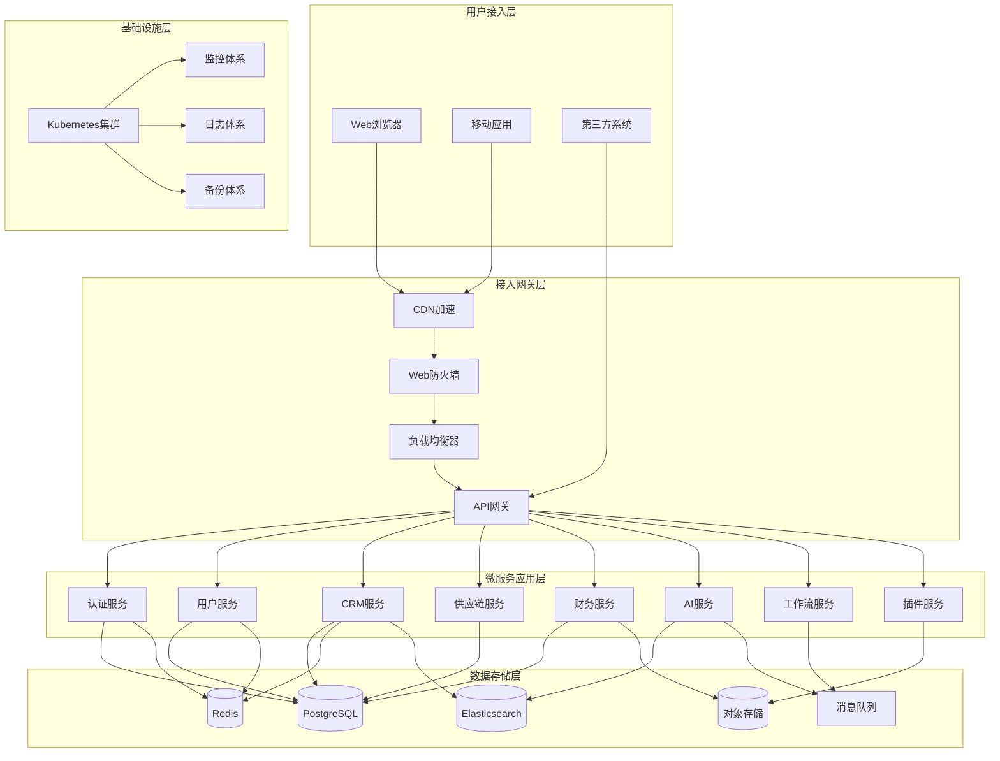

# 颠覆式模块化 ERP 系统 - 完整产品规划文档

## 目录
1. [产品愿景与定位](#1-产品愿景与定位)
2. [市场分析与竞争策略](#2-市场分析与竞争策略)
3. [核心功能架构](#3-核心功能架构)
4. [技术架构设计](#4-技术架构设计)
5. [商业模式设计](#5-商业模式设计)
6. [用户体验设计原则](#6-用户体验设计原则)
7. [开发路线图](#7-开发路线图)
8. [插件生态战略](#8-插件生态战略)
9. [部署与运维策略](#9-部署与运维策略)
10. [风险评估与应对](#10-风险评估与应对)

---

## 1. 产品愿景与定位

### 1.1 产品愿景
打造一个具有**颠覆性用户体验**的模块化 ERP 系统，就像 iPhone 重新定义手机一样，重新定义企业管理软件的使用体验。

### 1.2 核心价值主张
- **直观性**：用户打开界面一目了然，知道有什么、能做什么
- **即时反馈**：所有操作立即获得有效反馈，无论正确或错误
- **流程化**：复杂流程通过傻瓜式"下一步"完成
- **自动化**：重复性工作完全自动化处理
- **模块化**：任意组合的可插拔付费模块
- **智能化**：AI 大语言模型深度集成

### 1.3 目标市场
- **主要市场**：不限制企业规模，对所有企业开放
- **免费策略**：20人以下企业可使用完整基础模块
- **付费策略**：按模块、按用户、按功能的灵活计费模式

### 1.4 差异化优势
| 维度 | 传统ERP | 我们的ERP |
|------|---------|-----------|
| **用户体验** | 复杂难用，学习成本高 | 直观简单，即用即会 |
| **架构设计** | 单体架构，难以扩展 | 模块化架构，灵活组合 |
| **部署方式** | 私有化为主 | 云原生+私有化双模式 |
| **AI集成** | 缺乏或浅层集成 | 深度集成，核心能力 |
| **定制能力** | 需要专业开发 | 用户自助配置 |
| **生态开放** | 封闭系统 | 开放插件市场 |

---

## 2. 市场分析与竞争策略

### 2.1 主要竞品分析

#### 2.1.1 国内主流厂商
**金蝶 (Kingdee)**
- 市场地位：国内领先，主攻中大型企业
- 产品线：云星空、K/3、精斗云
- 优势：功能完善、行业深耕
- 劣势：用户体验复杂、学习成本高

**用友 (Yonyou)**
- 市场地位：老牌厂商，政企客户较多
- 产品线：NC、U8、U9、YonSuite
- 优势：政企关系、功能全面
- 劣势：界面陈旧、移动化不足

#### 2.1.2 国际主流厂商
**SAP**
- 市场地位：全球领导者，大型企业标杆
- 产品线：S/4HANA、SuccessFactors、Ariba
- 优势：功能强大、生态完善
- 劣势：价格昂贵、实施复杂

**Oracle**
- 市场地位：老牌数据库厂商转型云服务
- 产品线：Fusion Cloud ERP、NetSuite
- 优势：技术实力强、集成度高
- 劣势：学习曲线陡峭、定制复杂

### 2.2 我们的竞争策略

#### 2.2.1 产品差异化
1. **体验革命**：从复杂到简单的颠覆性体验
2. **模块革命**：从套装到按需组合的架构革命
3. **智能革命**：从工具到助手的AI革命
4. **生态革命**：从封闭到开放的生态革命

#### 2.2.2 市场切入策略
1. **先占领中小企业市场**：传统厂商服务不足的市场空白
2. **以CRM为突破口**：6个月打造完整CRM系统
3. **免费策略快速获客**：20人以下免费使用
4. **插件生态差异化**：开放第三方开发者

---

## 3. 核心功能架构

### 3.1 基础模块（免费提供）

#### 3.1.1 系统基础设施
```
基础模块架构
├── 认证授权系统 (4A)
│   ├── Authentication (身份认证)
│   │   ├── 多因素认证 (MFA)
│   │   ├── SSO 单点登录
│   │   └── 第三方登录集成
│   ├── Authorization (权限授权)
│   │   ├── RBAC 角色权限
│   │   ├── 按钮级权限控制
│   │   ├── 字段级权限控制
│   │   └── 记录级权限控制
│   ├── Audit (审计日志)
│   │   ├── 操作日志追踪
│   │   ├── 数据变更记录
│   │   ├── 全链路日志
│   │   └── 业务回放功能
│   └── Administration (系统管理)
│       ├── 用户管理
│       ├── 组织架构管理
│       ├── 权限动态配置
│       └── 系统参数设置
├── 多租户架构
│   ├── 租户数据隔离 (可配置)
│   ├── 共享数据库模式
│   ├── 独立数据库模式
│   └── 混合部署模式
└── 基础业务模块
    ├── 进销存管理
    ├── 物流管理
    ├── 电商集成
    ├── 支付系统
    ├── 发票管理
    ├── 合同管理
    ├── 报表系统
    └── 导入导出工具
```

#### 3.1.2 用户界面定制
- **动态表单生成**：基于数据类型自动绑定UI组件
- **布局自定义**：用户可自定义页面布局
- **主题配置**：企业品牌色彩和Logo定制
- **快捷操作**：常用功能一键访问

### 3.2 可插拔付费模块

#### 3.2.1 核心业务模块
```
付费模块生态
├── CRM 客户关系管理
│   ├── 客户管理
│   ├── 商机管理
│   ├── 销售流程
│   └── 客户服务
├── 采购管理
│   ├── 供应商管理
│   ├── 采购申请
│   ├── 采购订单
│   └── 供应商评估
├── 高级库存
│   ├── 多仓库管理
│   ├── 批次追踪
│   ├── 库存预警
│   └── 智能补货
├── 财务管理
│   ├── 总账管理
│   ├── 应收应付
│   ├── 成本核算
│   └── 财务报表
├── 人力资源
│   ├── 员工档案
│   ├── 考勤管理
│   ├── 薪酬管理
│   └── 绩效评估
└── 行业特定模块
    ├── 制造业生产管理
    ├── 零售业门店管理
    ├── 服务业项目管理
    └── 电商平台集成
```

#### 3.2.2 AI智能模块
```
AI 核心能力
├── 智能问答
│   ├── 业务咨询机器人
│   ├── 操作指导助手
│   └── 政策法规查询
├── 产品知识库
│   ├── 智能产品推荐
│   ├── 产品信息管理
│   └── 技术文档生成
├── 智能客服
│   ├── 多渠道接入
│   ├── 意图识别
│   └── 自动工单生成
├── 流程自动化
│   ├── 智能审批
│   ├── 异常预警
│   └── 决策建议
└── AI 模型管理
    ├── 多供应商集成
    ├── 自定义模型接入
    ├── 统一API网关
    └── 成本控制管理
```

#### 3.2.3 高级功能模块
- **工作流引擎**：可视化流程设计器
- **商业智能**：数据分析和可视化
- **移动应用**：原生移动端体验
- **API集成**：第三方系统对接
- **数据爬虫**：自动化数据采集
- **加盟商管理**：多级分销体系

---

## 4. 技术架构设计

### 4.1 整体架构原则
- **云原生设计**：容器化、微服务、服务网格
- **多模式部署**：SaaS云服务 + 私有化部署
- **弹性扩展**：自动扩缩容、负载均衡
- **安全优先**：数据加密、权限控制、审计追踪
- **高可用性**：99.99%可用性保障

### 4.2 多端支持战略

#### 4.2.1 全平台覆盖策略
```
多端支持架构
├── PC 桌面端
│   ├── Web 浏览器版 (主要版本)
│   │   ├── Chrome / Edge / Firefox / Safari
│   │   ├── 响应式设计 (1366px - 2560px)
│   │   ├── 完整功能支持
│   │   └── 键盘快捷键优化
│   └── 桌面应用版 (可选)
│       ├── Electron 跨平台应用
│       ├── Windows / macOS / Linux
│       ├── 离线数据缓存
│       └── 系统集成功能
├── 移动端
│   ├── 手机端 (375px - 414px)
│   │   ├── 响应式 Web 版
│   │   ├── PWA 渐进式应用
│   │   ├── React Native 原生 APP
│   │   └── 微信小程序
│   └── 平板端 (768px - 1024px)
│       ├── 响应式 Web 版
│       ├── iPad / Android 平板优化
│       ├── 分屏多任务支持
│       └── 手势操作优化
├── 小程序生态
│   ├── 微信小程序 (主推)
│   │   ├── 核心业务功能
│   │   ├── 微信生态集成
│   │   ├── 企业微信对接
│   │   └── 轻量级操作
│   ├── 支付宝小程序
│   │   ├── 商务场景优化
│   │   ├── 支付功能集成
│   │   └── 企业服务对接
│   ├── 钉钉小程序
│   │   ├── 办公场景集成
│   │   ├── 审批流程对接
│   │   └── 组织架构同步
│   └── 企业微信应用
│       ├── 企业内部应用
│       ├── 单点登录
│       ├── 通讯录同步
│       └── 消息推送
└── 跨端技术栈
    ├── 前端框架: React 18 + TypeScript
    ├── 移动端: React Native + Expo
    ├── 小程序: Taro 3.x 跨端框架
    ├── 桌面端: Electron (可选)
    ├── PWA: Service Worker + Manifest
    └── 样式方案: TailwindCSS 响应式设计
```

#### 4.2.2 多端功能分层策略
```typescript
// 多端功能分层
interface MultiPlatformFeatures {
  // 核心功能层 (所有端支持)
  core: {
    authentication: "认证登录",
    dashboard: "数据仪表板",
    notifications: "消息通知",
    search: "全局搜索",
    profile: "个人设置"
  };

  // 业务功能层 (PC完整，移动核心)
  business: {
    pc_full: {
      crm: "完整CRM功能",
      finance: "财务管理",
      inventory: "库存管理",
      reports: "复杂报表",
      admin: "系统管理",
      workflow: "工作流设计"
    },
    mobile_core: {
      customer: "客户查看/编辑",
      opportunity: "商机跟进",
      approval: "移动审批",
      inventory_check: "库存查询",
      simple_reports: "简化报表",
      notifications: "消息处理"
    },
    miniprogram_light: {
      customer_view: "客户查看",
      quick_approval: "快速审批",
      inventory_lookup: "库存查询",
      data_entry: "数据录入",
      message_center: "消息中心"
    }
  };

  // 增强功能层 (特定端特有)
  enhanced: {
    pc_exclusive: {
      advanced_charts: "高级图表",
      bulk_operations: "批量操作",
      complex_forms: "复杂表单",
      multi_window: "多窗口操作",
      keyboard_shortcuts: "键盘快捷键"
    },
    mobile_exclusive: {
      camera_scan: "扫码功能",
      location_services: "位置服务",
      push_notifications: "推送通知",
      offline_sync: "离线同步",
      voice_input: "语音输入"
    },
    miniprogram_exclusive: {
      wechat_integration: "微信生态集成",
      social_sharing: "社交分享",
      payment_integration: "支付集成",
      quick_actions: "快捷操作"
    }
  };
}
```

#### 4.2.3 响应式设计规范
```scss
// 多端响应式断点
$breakpoints: (
  'mobile-s': 320px,     // 小屏手机
  'mobile': 375px,       // 标准手机
  'mobile-l': 414px,     // 大屏手机
  'tablet': 768px,       // 平板竖屏
  'tablet-l': 1024px,    // 平板横屏
  'desktop': 1366px,     // 标准桌面
  'desktop-l': 1440px,   // 大屏桌面
  'desktop-xl': 1920px,  // 高分辨率桌面
  'desktop-4k': 2560px   // 4K显示器
);

// 自适应布局策略
.responsive-layout {
  // 移动端优先设计
  .mobile-first {
    display: flex;
    flex-direction: column;
    padding: 16px;

    @media (min-width: 768px) {
      flex-direction: row;
      padding: 24px;
    }

    @media (min-width: 1366px) {
      padding: 32px;
      max-width: 1200px;
      margin: 0 auto;
    }
  }

  // 流式网格系统
  .fluid-grid {
    display: grid;
    grid-template-columns: 1fr; // 移动端单列
    gap: 16px;

    @media (min-width: 768px) {
      grid-template-columns: repeat(2, 1fr); // 平板双列
    }

    @media (min-width: 1366px) {
      grid-template-columns: repeat(3, 1fr); // 桌面三列
    }
  }
}
```

### 4.3 技术栈选择

#### 4.3.1 后端技术栈
```go
// 核心框架
后端架构 = {
    框架: "Go 1.24+ with Kratos Framework",
    架构模式: "微服务架构 + DDD领域驱动设计",
    通信协议: ["gRPC", "REST API", "WebSocket"],
    数据存储: {
        关系数据库: "PostgreSQL 15+ (主库)",
        缓存系统: "Redis 7+ (缓存/会话/分布式锁)",
        搜索引擎: "Elasticsearch 8+ (全文搜索)",
        对象存储: "MinIO / AWS S3 (文件存储)",
        时序数据库: "InfluxDB (监控指标)"
    },
    消息队列: "RabbitMQ / Apache Kafka",
    服务发现: "Consul / Etcd",
    配置中心: "Apollo / Nacos",
    监控体系: {
        链路追踪: "Jaeger",
        指标监控: "Prometheus + Grafana",
        日志收集: "ELK Stack (Elasticsearch + Logstash + Kibana)",
        错误监控: "Sentry"
    }
}
```

#### 4.2.2 前端技术栈
```typescript
// 前端架构
前端架构 = {
    核心框架: "React 18 + TypeScript 5",
    路由管理: "React Router 6",
    状态管理: "Zustand + React Query",
    UI组件库: {
        基础组件: "Ant Design 5.x",
        图标系统: "Ant Design Icons + Lucide",
        样式方案: "TailwindCSS + CSS-in-JS"
    },
    构建工具: "Vite 5 + SWC",
    代码质量: {
        代码检查: "ESLint + Prettier",
        类型检查: "TypeScript Strict Mode",
        测试框架: "Vitest + React Testing Library",
        E2E测试: "Playwright"
    },
    性能优化: {
        代码分割: "React.lazy + Suspense",
        懒加载: "Intersection Observer",
        缓存策略: "React Query + Service Worker",
        包分析: "Bundle Analyzer"
    }
}
```

#### 4.2.3 基础设施技术栈
```yaml
# 基础设施
infrastructure:
  容器化:
    - Docker (应用容器化)
    - Docker Compose (本地开发)

  容器编排:
    - Kubernetes (生产环境)
    - Helm (应用包管理)
    - ArgoCD (GitOps部署)

  API网关:
    - Kong / APISIX (API管理)
    - Nginx (负载均衡/反向代理)

  数据库架构:
    - 主从复制 (读写分离)
    - 分库分表 (数据量大时)
    - 连接池 (PgBouncer)

  安全体系:
    - OAuth 2.0 / JWT (认证授权)
    - HTTPS/TLS 1.3 (传输加密)
    - AES-256 (数据加密)
    - WAF (Web应用防火墙)

  CI/CD:
    - GitLab CI/CD (持续集成)
    - Harbor (容器镜像仓库)
    - SonarQube (代码质量)
    - Trivy (安全扫描)
```

### 4.3 系统架构图



### 4.4 数据库设计策略

#### 4.4.1 多租户数据隔离策略
```sql
-- 支持两种模式的可配置数据隔离

-- 模式一：共享数据库 + 租户ID (tenant_id)
CREATE TABLE users (
    id UUID PRIMARY KEY,
    tenant_id UUID NOT NULL,  -- 租户隔离
    username VARCHAR(50) UNIQUE NOT NULL,
    email VARCHAR(100) UNIQUE NOT NULL,
    created_at TIMESTAMP DEFAULT NOW()
);

-- 模式二：独立数据库 (每个租户独立数据库)
-- 数据库命名：erp_tenant_{tenant_id}
-- 通过配置决定使用哪种模式

-- 配置表 (全局配置数据库)
CREATE TABLE tenant_config (
    tenant_id UUID PRIMARY KEY,
    isolation_mode VARCHAR(20) DEFAULT 'shared', -- 'shared' or 'isolated'
    database_name VARCHAR(100),
    created_at TIMESTAMP DEFAULT NOW()
);
```

#### 4.4.2 权限系统数据模型
```sql
-- 4A权限系统核心表结构

-- 组织架构表
CREATE TABLE organizations (
    id UUID PRIMARY KEY,
    tenant_id UUID NOT NULL,
    parent_id UUID REFERENCES organizations(id),
    name VARCHAR(100) NOT NULL,
    type VARCHAR(20) NOT NULL, -- 'company', 'department', 'team'
    level INTEGER NOT NULL,
    path TEXT NOT NULL, -- 组织路径，用于权限计算
    created_at TIMESTAMP DEFAULT NOW()
);

-- 用户表
CREATE TABLE users (
    id UUID PRIMARY KEY,
    tenant_id UUID NOT NULL,
    org_id UUID REFERENCES organizations(id),
    username VARCHAR(50) UNIQUE NOT NULL,
    email VARCHAR(100) UNIQUE NOT NULL,
    mobile VARCHAR(20),
    status VARCHAR(20) DEFAULT 'active',
    created_at TIMESTAMP DEFAULT NOW()
);

-- 角色表
CREATE TABLE roles (
    id UUID PRIMARY KEY,
    tenant_id UUID NOT NULL,
    name VARCHAR(50) NOT NULL,
    description TEXT,
    scope VARCHAR(20) DEFAULT 'tenant', -- 'tenant', 'org', 'dept'
    created_at TIMESTAMP DEFAULT NOW()
);

-- 权限表
CREATE TABLE permissions (
    id UUID PRIMARY KEY,
    resource VARCHAR(100) NOT NULL, -- 资源标识
    action VARCHAR(50) NOT NULL,    -- 操作类型
    condition JSONB,                -- 权限条件
    created_at TIMESTAMP DEFAULT NOW()
);

-- 角色权限关联表
CREATE TABLE role_permissions (
    role_id UUID REFERENCES roles(id),
    permission_id UUID REFERENCES permissions(id),
    data_scope VARCHAR(20) DEFAULT 'all', -- 'all', 'org', 'dept', 'team', 'self'
    PRIMARY KEY (role_id, permission_id)
);

-- 用户角色关联表
CREATE TABLE user_roles (
    user_id UUID REFERENCES users(id),
    role_id UUID REFERENCES roles(id),
    granted_by UUID REFERENCES users(id),
    granted_at TIMESTAMP DEFAULT NOW(),
    PRIMARY KEY (user_id, role_id)
);

-- 数据权限配置表 (支持动态字段权限配置)
CREATE TABLE field_permissions (
    id UUID PRIMARY KEY,
    tenant_id UUID NOT NULL,
    resource VARCHAR(100) NOT NULL,
    field_name VARCHAR(100) NOT NULL,
    role_id UUID REFERENCES roles(id),
    permission_type VARCHAR(20) NOT NULL, -- 'read', 'write', 'hidden'
    created_at TIMESTAMP DEFAULT NOW()
);
```

### 4.5 API设计规范

#### 4.5.1 RESTful API 设计标准
```typescript
// API设计标准

interface APIResponse<T> {
  code: number;           // 业务状态码
  message: string;        // 响应消息
  data: T;               // 响应数据
  timestamp: string;      // 时间戳
  request_id: string;     // 请求追踪ID
}

// 标准HTTP状态码使用
const HttpStatus = {
  OK: 200,                    // 成功
  CREATED: 201,              // 创建成功
  ACCEPTED: 202,             // 已接受
  NO_CONTENT: 204,           // 无内容
  BAD_REQUEST: 400,          // 请求错误
  UNAUTHORIZED: 401,         // 未授权
  FORBIDDEN: 403,            // 禁止访问
  NOT_FOUND: 404,            // 资源不存在
  CONFLICT: 409,             // 冲突
  UNPROCESSABLE_ENTITY: 422, // 参数验证失败
  INTERNAL_SERVER_ERROR: 500 // 服务器内部错误
};

// API路径设计规范
const APIRoutes = {
  // 用户管理
  users: {
    list: 'GET /api/v1/users',
    create: 'POST /api/v1/users',
    detail: 'GET /api/v1/users/:id',
    update: 'PUT /api/v1/users/:id',
    delete: 'DELETE /api/v1/users/:id',
    batch: 'POST /api/v1/users/batch'
  },

  // CRM客户管理
  customers: {
    list: 'GET /api/v1/crm/customers',
    create: 'POST /api/v1/crm/customers',
    detail: 'GET /api/v1/crm/customers/:id',
    update: 'PUT /api/v1/crm/customers/:id',
    delete: 'DELETE /api/v1/crm/customers/:id',
    export: 'POST /api/v1/crm/customers/export'
  }
};
```

#### 4.5.2 GraphQL API 考虑 (未来扩展)
```graphql
# 虽然当前不实现GraphQL，但预留扩展能力

type Query {
  # 用户查询
  user(id: ID!): User
  users(filter: UserFilter, pagination: Pagination): UserConnection

  # 客户查询
  customer(id: ID!): Customer
  customers(filter: CustomerFilter, pagination: Pagination): CustomerConnection
}

type Mutation {
  # 用户操作
  createUser(input: CreateUserInput!): User
  updateUser(id: ID!, input: UpdateUserInput!): User
  deleteUser(id: ID!): Boolean

  # 客户操作
  createCustomer(input: CreateCustomerInput!): Customer
  updateCustomer(id: ID!, input: UpdateCustomerInput!): Customer
}
```

---

## 5. 商业模式设计

### 5.1 多元化收费模式

#### 5.1.1 免费策略
```
免费版本 (20人以下企业)
├── 基础模块完全免费
│   ├── 用户管理 (最多20个用户)
│   ├── 组织架构管理
│   ├── 基础权限系统
│   ├── 进销存管理
│   ├── 基础报表
│   └── 导入导出功能
├── 技术支持
│   ├── 在线文档
│   ├── 视频教程
│   └── 社区论坛
└── 限制条件
    ├── 用户数量: ≤ 20人
    ├── 数据存储: 10GB
    ├── API调用: 1000次/月
    └── 客服支持: 仅社区支持
```

#### 5.1.2 付费模式组合
```
付费策略组合
├── SaaS 订阅模式
│   ├── 基础版: ¥50/用户/月
│   ├── 专业版: ¥100/用户/月
│   ├── 企业版: ¥200/用户/月
│   └── 定制版: 按需报价
├── 功能模块付费
│   ├── CRM模块: ¥30/用户/月
│   ├── 财务模块: ¥50/用户/月
│   ├── AI模块: ¥100/用户/月
│   └── 行业模块: ¥80-150/用户/月
├── 私有化部署
│   ├── 标准版: ¥50万起 (一次性)
│   ├── 企业版: ¥100万起 (一次性)
│   └── 维护费: 20%/年
└── 增值服务
    ├── 实施服务: ¥1000-5000/人天
    ├── 定制开发: ¥1500-3000/人天
    ├── 培训服务: ¥800-1500/人天
    └── 数据迁移: ¥5000-50000/项目
```

### 5.2 插件生态商业模式

#### 5.2.1 插件市场运营策略
```
插件市场生态
├── 免费插件
│   ├── 开发者免费发布
│   ├── 平台不收取费用
│   ├── 需要审核 (人工+AI)
│   └── 促进生态建设
├── 付费插件
│   ├── 个人开发者
│   │   ├── 实名认证
│   │   ├── 保证金: ¥5000
│   │   └── 平台分成: 30%
│   └── 企业开发者
│       ├── 营业执照认证
│       ├── 保证金: ¥50000
│       └── 平台分成: 20%
├── 审核机制
│   ├── 自动化审核
│   │   ├── 代码安全扫描
│   │   ├── 性能测试
│   │   └── 兼容性检测
│   └── 人工审核
│       ├── 功能验证
│       ├── 用户体验评估
│       └── 内容合规检查
└── 质量保障
    ├── 用户评分系统
    ├── 退款保障机制
    ├── 技术支持要求
    └── 定期安全审计
```

#### 5.2.2 AI服务计费模型
```
AI服务定价策略
├── 自购模式 (用户自己的API Key)
│   ├── 用户自行购买AI服务
│   ├── 平台仅提供技术集成
│   ├── 成本完全由用户承担
│   └── 平台收取技术服务费
├── 平台代购模式
│   ├── 批量采购降低成本
│   ├── 按使用量计费
│   ├── 智能问答: ¥0.01/次
│   ├── 文档生成: ¥0.1/页
│   ├── 数据分析: ¥1/报告
│   └── 智能审批: ¥0.05/流程
├── 包月套餐
│   ├── 基础包: ¥100/月 (1000次调用)
│   ├── 专业包: ¥500/月 (10000次调用)
│   ├── 企业包: ¥2000/月 (50000次调用)
│   └── 无限包: ¥5000/月 (不限次数)
└── 混合计费
    ├── 基础免费额度
    ├── 超出部分按量计费
    ├── 月度封顶保护
    └── 企业协议价格
```

---

## 6. 用户体验设计原则

### 6.1 核心设计理念

#### 6.1.1 直观性设计
- **一目了然原则**：用户打开任何页面都能立即理解当前位置和可执行操作
- **视觉层次清晰**：重要信息突出显示，次要信息适当弱化
- **操作路径简短**：关键功能不超过3次点击到达
- **状态可见性**：系统状态实时反馈，处理进度可视化

#### 6.1.2 即时反馈机制
```typescript
// 反馈系统设计
interface FeedbackSystem {
  // 操作反馈
  immediate: {
    loading: "骨架屏 + 进度条",      // 加载状态
    success: "绿色提示 + 动画效果",   // 成功反馈
    error: "红色提示 + 解决方案",     // 错误反馈
    warning: "橙色提示 + 注意事项"    // 警告提示
  };

  // 表单验证
  validation: {
    realtime: "实时校验 + 即时提示",  // 输入时验证
    submit: "提交前完整性检查",       // 提交时验证
    suggest: "智能建议 + 自动补全"    // 输入建议
  };

  // 数据变更
  dataChange: {
    optimistic: "乐观更新 + 回滚机制", // 先更新UI再同步
    broadcast: "实时同步其他用户",     // 多用户协作
    conflict: "冲突检测 + 合并策略"    // 并发冲突处理
  };
}
```

#### 6.1.3 流程化设计
```typescript
// 复杂流程简化策略
interface ProcessSimplification {
  // 分步引导
  stepByStep: {
    wizard: "向导式引导",           // 复杂表单分步骤
    progress: "进度显示",          // 当前步骤/总步骤
    navigation: "上一步/下一步",    // 步骤导航
    save: "草稿保存"              // 中途保存
  };

  // 智能默认值
  smartDefaults: {
    context: "基于上下文推荐",      // 根据历史数据推荐
    template: "模板快速填充",       // 常用模板
    autocomplete: "自动补全",      // 输入时自动完成
    bulk: "批量处理"              // 相似操作批量执行
  };

  // 快捷操作
  shortcuts: {
    hotkeys: "键盘快捷键",         // Ctrl+S 保存等
    quickAction: "右键菜单",       // 上下文菜单
    floating: "悬浮操作按钮",       // 常用功能快速访问
    voice: "语音指令" // 未来功能   // AI语音操作
  };
}
```

### 6.2 界面设计规范

#### 6.2.1 布局系统
```scss
// 基于 Ant Design + TailwindCSS 的布局规范

// 全局布局
.app-layout {
  display: grid;
  grid-template-areas:
    "header header"
    "sidebar main"
    "footer footer";
  grid-template-rows: 64px 1fr 32px;
  grid-template-columns: 240px 1fr;
  height: 100vh;

  &.collapsed {
    grid-template-columns: 80px 1fr;
  }
}

// 页面布局
.page-layout {
  padding: 24px;

  .page-header {
    margin-bottom: 24px;
    border-bottom: 1px solid #f0f0f0;
    padding-bottom: 16px;
  }

  .page-content {
    background: white;
    border-radius: 8px;
    padding: 24px;
    box-shadow: 0 2px 8px rgba(0,0,0,0.1);
  }
}

// 响应式断点
$breakpoints: (
  'mobile': 576px,    // 手机
  'tablet': 768px,    // 平板
  'desktop': 992px,   // 桌面
  'large': 1200px,    // 大屏
  'xlarge': 1600px    // 超大屏
);
```

#### 6.2.2 设计代币 (Design Tokens)
```typescript
// 设计系统代币
export const DesignTokens = {
  // 颜色系统
  colors: {
    primary: '#1890ff',        // 主色
    success: '#52c41a',        // 成功
    warning: '#faad14',        // 警告
    error: '#f5222d',          // 错误
    info: '#1890ff',           // 信息

    // 灰度系统
    gray: {
      50: '#fafafa',
      100: '#f5f5f5',
      200: '#f0f0f0',
      300: '#d9d9d9',
      400: '#bfbfbf',
      500: '#8c8c8c',
      600: '#595959',
      700: '#434343',
      800: '#262626',
      900: '#1f1f1f'
    }
  },

  // 字体系统
  typography: {
    fontFamily: {
      sans: ['-apple-system', 'BlinkMacSystemFont', 'Segoe UI'],
      mono: ['SFMono-Regular', 'Consolas', 'Liberation Mono']
    },
    fontSize: {
      xs: '12px',    // 辅助文字
      sm: '14px',    // 正文
      base: '16px',  // 基础
      lg: '18px',    // 标题4
      xl: '20px',    // 标题3
      '2xl': '24px', // 标题2
      '3xl': '30px', // 标题1
      '4xl': '36px'  // 主标题
    }
  },

  // 间距系统
  spacing: {
    xs: '4px',
    sm: '8px',
    base: '16px',
    lg: '24px',
    xl: '32px',
    '2xl': '48px',
    '3xl': '64px'
  },

  // 阴影系统
  shadows: {
    sm: '0 1px 3px rgba(0,0,0,0.1)',
    base: '0 2px 8px rgba(0,0,0,0.1)',
    lg: '0 4px 16px rgba(0,0,0,0.1)',
    xl: '0 8px 32px rgba(0,0,0,0.1)'
  }
};
```

### 6.3 可访问性设计

#### 6.3.1 无障碍访问标准
```typescript
// WCAG 2.1 AA 级标准实现
interface AccessibilityStandards {
  // 键盘导航
  keyboard: {
    tabIndex: "合理的Tab顺序",
    shortcuts: "快捷键支持",
    focus: "明显的焦点指示器",
    escape: "ESC键退出模态框"
  };

  // 屏幕阅读器
  screenReader: {
    semantics: "语义化HTML标签",
    aria: "ARIA标签完整",
    alt: "图片替代文本",
    roles: "角色定义清晰"
  };

  // 色彩对比
  contrast: {
    ratio: "4.5:1对比度",
    colorBlind: "色盲友好设计",
    noColorOnly: "不仅依赖颜色传达信息"
  };

  // 字体与间距
  typography: {
    minSize: "最小14px字体",
    lineHeight: "1.5倍行高",
    spacing: "充足的点击区域",
    zoom: "支持200%缩放"
  };
}
```

---

## 7. 开发路线图

### 7.1 第一阶段：基础设施建设 (月度1-2)

#### 7.1.1 技术基础设施
**Week 1-2: 项目初始化**
- [x] 项目结构设计
- [ ] Go Kratos 微服务框架搭建
- [ ] React + TypeScript 前端架构
- [ ] Docker 容器化配置
- [ ] CI/CD 流水线搭建

**Week 3-4: 核心服务开发**
- [ ] 认证授权服务 (4A系统)
- [ ] 用户管理服务
- [ ] 多租户架构实现
- [ ] API 网关配置

**Week 5-6: 基础功能**
- [ ] 组织架构管理
- [ ] 权限系统 (按钮/字段/记录级)
- [ ] 审计日志系统
- [ ] 基础UI组件库

**Week 7-8: 集成测试**
- [ ] 单元测试编写
- [ ] 集成测试
- [ ] 性能测试
- [ ] 安全测试

### 7.2 第二阶段：CRM系统开发 (月度3-6)

#### 7.2.1 CRM核心模块
**Month 3: 客户管理**
```typescript
// CRM开发计划
const CRMRoadmap = {
  month3: {
    customer: {
      basic: "客户基础信息管理",
      contact: "联系人管理",
      address: "地址簿管理",
      tag: "客户标签系统",
      category: "客户分类管理"
    },
    ui: {
      list: "客户列表页面",
      detail: "客户详情页面",
      form: "客户编辑表单",
      search: "高级搜索功能",
      export: "数据导出功能"
    }
  },

  month4: {
    opportunity: {
      pipeline: "销售漏斗管理",
      stage: "阶段管理",
      forecast: "销售预测",
      activity: "销售活动追踪",
      competitor: "竞争对手分析"
    },
    automation: {
      workflow: "销售流程自动化",
      reminder: "跟进提醒",
      assignment: "线索自动分配",
      escalation: "升级机制"
    }
  },

  month5: {
    quotation: {
      template: "报价单模板",
      calculation: "价格计算引擎",
      approval: "审批流程",
      version: "版本管理",
      convert: "转换为订单"
    },
    order: {
      creation: "订单创建",
      tracking: "订单跟踪",
      fulfillment: "订单履行",
      billing: "开票管理"
    }
  },

  month6: {
    analytics: {
      dashboard: "CRM仪表板",
      reports: "销售报表",
      kpi: "关键指标监控",
      forecast: "业绩预测",
      trends: "趋势分析"
    },
    integration: {
      email: "邮件集成",
      calendar: "日历同步",
      phone: "电话系统集成",
      marketing: "营销自动化"
    }
  }
};
```

#### 7.2.2 CRM功能特性
```typescript
// CRM核心功能规格
interface CRMFeatures {
  // 360度客户视图
  customerView: {
    profile: "完整客户档案",
    timeline: "互动时间线",
    documents: "相关文档",
    communication: "沟通记录",
    orders: "订单历史",
    support: "服务记录"
  };

  // 销售流程管理
  salesProcess: {
    lead: "线索管理",
    qualification: "资格评估",
    proposal: "方案制作",
    negotiation: "商务谈判",
    closure: "成交管理",
    renewal: "续约管理"
  };

  // 智能功能
  intelligence: {
    scoring: "客户评分",
    recommendation: "推荐引擎",
    prediction: "成交预测",
    optimization: "流程优化",
    insights: "业务洞察"
  };

  // 移动应用
  mobile: {
    offline: "离线数据同步",
    geolocation: "地理位置",
    camera: "拍照上传",
    voice: "语音备注",
    push: "推送通知"
  };
}
```

### 7.3 第三阶段：核心模块扩展 (月度7-12)

#### 7.3.1 供应链管理 (SCM)
**Month 7-8: 采购管理**
- 供应商生命周期管理
- 采购申请与审批流程
- 询价比价系统
- 采购订单管理
- 收货与质检流程

**Month 9-10: 库存管理**
- 多仓库管理
- 库存实时监控
- 批次与序列号追踪
- 盘点与调拨
- 库存预警与补货

#### 7.3.2 财务管理
**Month 11-12: 基础财务**
- 总账管理
- 应收应付管理
- 费用报销系统
- 基础财务报表
- 成本核算

### 7.4 第四阶段：多端应用与AI智能化 (月度13-18)

#### 7.4.1 多端应用开发
```typescript
// 多端开发路线图
const MultiPlatformRoadmap = {
  month13: {
    mobile_web: {
      responsive_optimization: "响应式Web优化",
      touch_interactions: "触控交互优化",
      mobile_navigation: "移动端导航设计",
      performance_optimization: "移动端性能优化"
    },
    pwa: {
      service_worker: "Service Worker实现",
      offline_support: "离线功能支持",
      push_notifications: "推送通知",
      app_install: "应用安装提示"
    }
  },

  month14: {
    miniprogram: {
      wechat_miniprogram: "微信小程序开发",
      alipay_miniprogram: "支付宝小程序开发",
      dingtalk_app: "钉钉应用开发",
      enterprise_wechat: "企业微信应用"
    },
    cross_platform: {
      taro_framework: "Taro跨端框架搭建",
      shared_components: "共享组件库",
      unified_api: "统一API接口",
      state_management: "跨端状态管理"
    }
  },

  month15: {
    native_app: {
      react_native: "React Native应用",
      ios_optimization: "iOS端优化",
      android_optimization: "Android端优化",
      native_features: "原生功能集成"
    },
    tablet_optimization: {
      ipad_layout: "iPad布局优化",
      android_tablet: "Android平板适配",
      split_screen: "分屏功能支持",
      gesture_controls: "手势控制"
    }
  },

  month16: {
    desktop_app: {
      electron_app: "Electron桌面应用",
      system_integration: "系统集成功能",
      keyboard_shortcuts: "键盘快捷键",
      multi_window: "多窗口支持"
    },
    advanced_features: {
      offline_sync: "离线数据同步",
      real_time_collaboration: "实时协作",
      voice_commands: "语音控制",
      camera_integration: "摄像头集成"
    }
  }
};
```

#### 7.4.2 AI智能化
```typescript
// AI功能路线图
const AIRoadmap = {
  month17: {
    intelligent_core: {
      chatbot: "智能客服机器人",
      qa: "业务问答系统",
      search: "智能搜索",
      translation: "多语言翻译"
    },
    mobile_ai: {
      voice_assistant: "移动语音助手",
      image_recognition: "图像识别",
      text_extraction: "文字提取",
      smart_input: "智能输入建议"
    }
  },

  month18: {
    advanced_ai: {
      analysis: "智能数据分析",
      forecast: "业务预测",
      recommendation: "智能推荐",
      automation: "流程自动化"
    },
    ai_integration: {
      cross_platform: "跨端AI能力",
      edge_computing: "边缘计算",
      model_optimization: "模型优化",
      privacy_protection: "隐私保护"
    }
  }
};
```

#### 7.4.3 跨端功能特性对比
```typescript
// 功能特性矩阵
interface CrossPlatformFeatures {
  platform_matrix: {
    features: [
      { name: "客户管理", pc: "完整", mobile: "核心", tablet: "增强", miniprogram: "查看" },
      { name: "销售机会", pc: "完整", mobile: "核心", tablet: "增强", miniprogram: "跟进" },
      { name: "订单管理", pc: "完整", mobile: "查看", tablet: "编辑", miniprogram: "查看" },
      { name: "库存查询", pc: "完整", mobile: "查询", tablet: "管理", miniprogram: "查询" },
      { name: "财务报表", pc: "完整", mobile: "简化", tablet: "图表", miniprogram: "摘要" },
      { name: "工作流", pc: "设计+执行", mobile: "执行", tablet: "执行", miniprogram: "审批" },
      { name: "系统管理", pc: "完整", mobile: "❌", tablet: "基础", miniprogram: "❌" },
      { name: "数据导出", pc: "完整", mobile: "简单", tablet: "中等", miniprogram: "❌" },
      { name: "批量操作", pc: "完整", mobile: "❌", tablet: "基础", miniprogram: "❌" },
      { name: "实时通讯", pc: "完整", mobile: "完整", tablet: "完整", miniprogram: "基础" }
    ]
  };

  development_priority: {
    phase1: ["PC Web", "Mobile Web", "微信小程序"],
    phase2: ["PWA", "企业微信", "钉钉小程序"],
    phase3: ["React Native APP", "Electron桌面端"],
    phase4: ["支付宝小程序", "其他平台扩展"]
  };
}
```

#### 7.4.4 高级功能模块
- **工作流引擎与BPM** - 跨端流程设计与执行
- **商业智能与数据可视化** - 自适应图表与仪表板
- **多端数据同步** - 实时同步与离线支持
- **开放API与插件市场** - 跨平台插件支持
- **企业集成与数据迁移** - 统一集成接口

---

## 8. 插件生态战略

### 8.1 插件架构设计

#### 8.1.1 插件系统技术架构
```typescript
// 插件系统核心架构
interface PluginArchitecture {
  // 插件类型
  types: {
    microservice: "独立微服务插件",     // 完全独立的服务
    frontend: "前端组件插件",          // UI组件扩展
    backend: "后端模块插件",           // API扩展
    workflow: "工作流插件",            // 流程节点扩展
    connector: "连接器插件",           // 第三方集成
    theme: "主题插件",                // 界面主题
    language: "语言包插件"             // 多语言支持
  };

  // 插件生命周期
  lifecycle: {
    register: "插件注册",
    install: "安装部署",
    activate: "激活启用",
    configure: "配置设置",
    update: "版本更新",
    deactivate: "停用",
    uninstall: "卸载清理"
  };

  // 插件通信机制
  communication: {
    event: "事件总线",               // 事件驱动通信
    api: "REST API调用",            // 标准API接口
    webhook: "Webhook回调",         // 异步通知
    message: "消息队列",            // 异步消息
    database: "共享数据访问"         // 数据层集成
  };

  // 安全机制
  security: {
    sandbox: "沙箱隔离",            // 运行时隔离
    permission: "权限控制",          // 访问权限
    audit: "审计日志",              // 操作审计
    signature: "代码签名验证",       // 代码完整性
    resource: "资源限制"            // 资源使用限制
  };
}
```

#### 8.1.2 插件开发框架
```typescript
// 插件开发SDK
export class PluginSDK {
  // 插件基类
  abstract class BasePlugin {
    abstract name: string;
    abstract version: string;
    abstract description: string;
    abstract author: string;

    // 生命周期钩子
    onInstall?(): Promise<void>;
    onActivate?(): Promise<void>;
    onDeactivate?(): Promise<void>;
    onUninstall?(): Promise<void>;
    onUpdate?(oldVersion: string): Promise<void>;

    // 配置模式
    getConfigSchema?(): JSONSchema;
    validateConfig?(config: any): boolean;
  }

  // 前端插件基类
  abstract class FrontendPlugin extends BasePlugin {
    abstract render(): React.ComponentType;
    getRoutes?(): RouteConfig[];
    getMenuItems?(): MenuItem[];
    getToolbarItems?(): ToolbarItem[];
  }

  // 后端插件基类
  abstract class BackendPlugin extends BasePlugin {
    abstract getRoutes(): APIRoute[];
    getMiddleware?(): Middleware[];
    getEventHandlers?(): EventHandler[];
    getDatabaseMigrations?(): Migration[];
  }

  // 插件API接口
  interface PluginAPI {
    // 系统API
    system: {
      getUser(): User;
      getTenant(): Tenant;
      getSettings(): Settings;
      log(level: string, message: string): void;
    };

    // 数据API
    data: {
      query(sql: string, params?: any[]): Promise<any>;
      create(table: string, data: any): Promise<any>;
      update(table: string, id: string, data: any): Promise<any>;
      delete(table: string, id: string): Promise<boolean>;
    };

    // 事件API
    events: {
      emit(event: string, data?: any): void;
      on(event: string, handler: Function): void;
      off(event: string, handler: Function): void;
    };

    // UI API
    ui: {
      showNotification(message: string, type?: string): void;
      showModal(component: React.ComponentType): void;
      addMenuItem(item: MenuItem): void;
      addToolbarButton(button: ToolbarButton): void;
    };
  }
}
```

### 8.2 插件市场运营

#### 8.2.1 插件分类体系
```
插件市场分类
├── 行业解决方案
│   ├── 制造业
│   │   ├── 生产计划管理
│   │   ├── 设备维护管理
│   │   ├── 质量管理系统
│   │   └── 供应链优化
│   ├── 零售业
│   │   ├── 门店管理
│   │   ├── 会员管理
│   │   ├── 促销管理
│   │   └── 库存优化
│   ├── 服务业
│   │   ├── 项目管理
│   │   ├── 时间追踪
│   │   ├── 资源调度
│   │   └── 客户服务
│   └── 电商行业
│       ├── 多平台集成
│       ├── 订单同步
│       ├── 库存同步
│       └── 物流追踪
├── 功能扩展
│   ├── 报表分析
│   │   ├── 高级图表
│   │   ├── 自定义报表
│   │   ├── 数据挖掘
│   │   └── 预测分析
│   ├── 集成连接
│   │   ├── 支付网关
│   │   ├── 物流接口
│   │   ├── 财务软件
│   │   └── 办公套件
│   ├── 自动化工具
│   │   ├── 数据同步
│   │   ├── 批量处理
│   │   ├── 定时任务
│   │   └── 流程自动化
│   └── 通信工具
│       ├── 邮件营销
│       ├── 短信通知
│       ├── 即时通讯
│       └── 视频会议
├── 界面美化
│   ├── 主题模板
│   ├── 图标包
│   ├── 组件库
│   └── 动画效果
└── 开发工具
    ├── API测试
    ├── 数据生成
    ├── 性能监控
    └── 调试工具
```

#### 8.2.2 插件质量保障体系
```typescript
// 插件质量保障流程
interface QualityAssurance {
  // 自动化检测
  automated: {
    security: {
      scanning: "安全漏洞扫描",
      dependency: "依赖安全检查",
      permission: "权限合规检查",
      sandbox: "沙箱测试"
    },
    performance: {
      load: "负载测试",
      memory: "内存使用检查",
      response: "响应时间测试",
      resource: "资源消耗监控"
    },
    compatibility: {
      api: "API兼容性测试",
      browser: "浏览器兼容性",
      version: "版本兼容性",
      conflict: "插件冲突检测"
    },
    code: {
      lint: "代码规范检查",
      coverage: "测试覆盖率",
      complexity: "代码复杂度",
      duplication: "重复代码检测"
    }
  };

  // 人工审核
  manual: {
    functionality: {
      feature: "功能完整性验证",
      usability: "用户体验评估",
      documentation: "文档质量检查",
      demo: "演示效果验证"
    },
    content: {
      description: "描述内容审核",
      screenshot: "截图真实性",
      compliance: "内容合规检查",
      originality: "原创性验证"
    },
    business: {
      model: "商业模式合规",
      pricing: "定价合理性",
      support: "技术支持能力",
      maintenance: "维护承诺"
    }
  };

  // 持续监控
  monitoring: {
    runtime: {
      error: "运行时错误监控",
      crash: "崩溃报告收集",
      usage: "使用情况统计",
      feedback: "用户反馈收集"
    },
    security: {
      vulnerability: "安全漏洞监控",
      incident: "安全事件响应",
      update: "安全更新推送",
      audit: "定期安全审计"
    },
    performance: {
      metrics: "性能指标监控",
      optimization: "性能优化建议",
      bottleneck: "瓶颈识别",
      scaling: "扩展性评估"
    }
  };
}
```

### 8.3 开发者生态建设

#### 8.3.1 开发者支持体系
```
开发者生态建设
├── 开发工具链
│   ├── Plugin CLI 工具
│   ├── 本地开发环境
│   ├── 调试工具
│   ├── 性能分析工具
│   └── 自动化测试框架
├── 文档与教程
│   ├── 快速入门指南
│   ├── API 文档
│   ├── 最佳实践
│   ├── 示例代码库
│   └── 视频教程
├── 社区支持
│   ├── 开发者论坛
│   ├── 技术交流群
│   ├── 在线答疑
│   ├── 定期沙龙
│   └── 年度开发者大会
├── 激励机制
│   ├── 开发者认证体系
│   ├── 优秀插件推荐
│   ├── 收益分成计划
│   ├── 技术专家计划
│   └── 创新奖励基金
└── 技术支持
    ├── 专属技术顾问
    ├── 代码审核服务
    ├── 上架辅导
    ├── 营销支持
    └── 法务支持
```

#### 8.3.2 插件商店运营策略
```typescript
// 插件商店运营模型
interface PluginStoreStrategy {
  // 发现机制
  discovery: {
    featured: "精选推荐",
    trending: "热门插件",
    category: "分类浏览",
    search: "智能搜索",
    recommendation: "个性化推荐"
  };

  // 评价体系
  rating: {
    star: "五星评分",
    review: "用户评论",
    usage: "使用统计",
    compatibility: "兼容性评分",
    support: "技术支持评分"
  };

  // 营销推广
  marketing: {
    promotion: "促销活动",
    bundle: "插件套餐",
    trial: "免费试用",
    referral: "推荐奖励",
    content: "内容营销"
  };

  // 数据分析
  analytics: {
    download: "下载统计",
    usage: "使用分析",
    revenue: "收入分析",
    retention: "留存分析",
    feedback: "反馈分析"
  };
}
```

---

## 9. 部署与运维策略

### 9.1 多模式部署架构

#### 9.1.1 SaaS 云部署
```yaml
# SaaS云部署架构
saas_deployment:
  infrastructure:
    cloud_provider: ["AWS", "阿里云", "腾讯云"]
    regions: ["华北", "华东", "华南", "海外"]
    availability_zones: 3  # 多可用区部署

  architecture:
    frontend:
      cdn: "全球CDN加速"
      load_balancer: "应用负载均衡"
      auto_scaling: "自动扩缩容"

    backend:
      api_gateway: "Kong API Gateway"
      microservices: "K8s微服务集群"
      service_mesh: "Istio服务网格"
      message_queue: "RabbitMQ集群"

    database:
      primary: "PostgreSQL主从集群"
      cache: "Redis哨兵模式"
      search: "Elasticsearch集群"
      storage: "对象存储服务"

  scaling:
    horizontal: "水平扩展"
    vertical: "垂直扩展"
    auto: "基于CPU/内存/QPS自动扩容"

  monitoring:
    metrics: "Prometheus + Grafana"
    logging: "ELK Stack"
    tracing: "Jaeger"
    alerting: "PagerDuty"
```

#### 9.1.2 私有化部署
```yaml
# 私有化部署方案
private_deployment:
  deployment_modes:
    docker_compose:
      description: "单机Docker部署"
      target: "小型企业/测试环境"
      resources: "4Core 8GB 100GB"
      services: ["web", "api", "db", "cache"]

    kubernetes:
      description: "K8s集群部署"
      target: "中大型企业"
      resources: "3节点以上"
      components: ["master", "worker", "storage"]

    traditional:
      description: "传统服务器部署"
      target: "特殊环境要求"
      support: ["CentOS", "Ubuntu", "RHEL"]

  deployment_tools:
    ansible: "自动化部署脚本"
    helm: "K8s应用包管理"
    terraform: "基础设施即代码"

  backup_strategy:
    database:
      frequency: "每日全量 + 实时增量"
      retention: "30天本地 + 1年云端"
      encryption: "AES-256加密"

    files:
      frequency: "每日增量备份"
      storage: "本地 + 云端双重备份"
      verification: "自动备份验证"

    disaster_recovery:
      rpo: "< 1小时"  # 恢复点目标
      rto: "< 4小时"  # 恢复时间目标
      testing: "季度演练"
```

### 9.2 监控与运维体系

#### 9.2.1 全链路监控
```typescript
// 监控体系设计
interface MonitoringSystem {
  // 基础设施监控
  infrastructure: {
    servers: {
      cpu: "CPU使用率",
      memory: "内存使用率",
      disk: "磁盘使用率",
      network: "网络流量",
      temperature: "服务器温度"
    },
    network: {
      latency: "网络延迟",
      throughput: "网络吞吐量",
      packet_loss: "丢包率",
      connectivity: "连通性检查"
    },
    storage: {
      iops: "磁盘IOPS",
      throughput: "磁盘吞吐量",
      latency: "磁盘延迟",
      health: "磁盘健康状态"
    }
  };

  // 应用监控
  application: {
    performance: {
      response_time: "响应时间",
      throughput: "请求吞吐量",
      error_rate: "错误率",
      saturation: "饱和度"
    },
    business: {
      user_activity: "用户活跃度",
      conversion: "转化率",
      revenue: "收入指标",
      retention: "用户留存"
    },
    security: {
      login_attempts: "登录尝试",
      failed_requests: "失败请求",
      suspicious_activity: "可疑活动",
      vulnerability: "安全漏洞"
    }
  };

  // 数据库监控
  database: {
    performance: {
      query_time: "查询时间",
      connections: "连接数",
      lock_waits: "锁等待",
      buffer_hit_ratio: "缓冲命中率"
    },
    health: {
      replication_lag: "主从延迟",
      backup_status: "备份状态",
      disk_usage: "磁盘使用",
      slow_queries: "慢查询"
    }
  };

  // 告警机制
  alerting: {
    levels: ["info", "warning", "critical", "emergency"],
    channels: ["email", "sms", "webhook", "phone"],
    escalation: "分级响应机制",
    automation: "自动故障恢复"
  };
}
```

#### 9.2.2 日志管理系统
```typescript
// 日志系统设计
interface LoggingSystem {
  // 日志分类
  categories: {
    application: {
      access: "访问日志",
      error: "错误日志",
      debug: "调试日志",
      performance: "性能日志"
    },
    security: {
      auth: "认证日志",
      authorization: "授权日志",
      audit: "审计日志",
      intrusion: "入侵检测日志"
    },
    business: {
      operation: "业务操作日志",
      transaction: "交易日志",
      workflow: "工作流日志",
      integration: "集成日志"
    }
  };

  // 日志级别
  levels: {
    TRACE: "最详细的信息",
    DEBUG: "调试信息",
    INFO: "一般信息",
    WARN: "警告信息",
    ERROR: "错误信息",
    FATAL: "致命错误"
  };

  // 日志格式
  format: {
    structured: "结构化JSON格式",
    fields: {
      timestamp: "时间戳",
      level: "日志级别",
      service: "服务名称",
      trace_id: "追踪ID",
      user_id: "用户ID",
      tenant_id: "租户ID",
      message: "日志消息",
      context: "上下文信息"
    }
  };

  // 日志处理
  processing: {
    collection: "Filebeat日志收集",
    parsing: "Logstash日志解析",
    storage: "Elasticsearch存储",
    visualization: "Kibana可视化",
    retention: "分级保留策略"
  };

  // 业务回放
  replay: {
    capture: "操作步骤捕获",
    reconstruction: "场景重构",
    debugging: "错误调试",
    testing: "回归测试"
  };
}
```

### 9.3 安全与合规

#### 9.3.1 数据安全体系
```typescript
// 数据安全架构
interface DataSecurity {
  // 数据分类
  classification: {
    public: "公开数据",
    internal: "内部数据",
    confidential: "机密数据",
    restricted: "限制数据"
  };

  // 加密策略
  encryption: {
    at_rest: {
      database: "数据库透明加密",
      files: "文件系统加密",
      backup: "备份数据加密",
      algorithm: "AES-256-GCM"
    },
    in_transit: {
      https: "HTTPS/TLS 1.3",
      api: "API通信加密",
      internal: "微服务间加密",
      vpn: "VPN隧道加密"
    },
    key_management: {
      rotation: "密钥定期轮换",
      storage: "硬件安全模块",
      access: "密钥访问控制",
      audit: "密钥使用审计"
    }
  };

  // 访问控制
  access_control: {
    authentication: {
      mfa: "多因素认证",
      sso: "单点登录",
      oauth: "OAuth 2.0",
      jwt: "JWT令牌"
    },
    authorization: {
      rbac: "基于角色的访问控制",
      abac: "基于属性的访问控制",
      data_scope: "数据范围控制",
      field_level: "字段级权限"
    }
  };

  // 数据治理
  governance: {
    privacy: {
      gdpr: "GDPR合规",
      data_minimization: "数据最小化",
      purpose_limitation: "用途限制",
      retention: "数据保留策略"
    },
    quality: {
      validation: "数据验证",
      cleansing: "数据清洗",
      monitoring: "质量监控",
      lineage: "数据血缘"
    },
    lifecycle: {
      creation: "数据创建",
      processing: "数据处理",
      storage: "数据存储",
      archival: "数据归档",
      deletion: "数据销毁"
    }
  };

  // 审计与合规
  compliance: {
    audit_trail: "完整审计轨迹",
    real_time_monitoring: "实时监控",
    compliance_reporting: "合规报告",
    penetration_testing: "渗透测试",
    vulnerability_scanning: "漏洞扫描"
  };
}
```

#### 9.3.2 业务连续性保障
```typescript
// 业务连续性计划
interface BusinessContinuity {
  // 灾难恢复
  disaster_recovery: {
    rpo: "恢复点目标 < 1小时",
    rto: "恢复时间目标 < 4小时",
    strategy: {
      hot_standby: "热备份",
      warm_standby: "温备份",
      cold_standby: "冷备份"
    },
    testing: {
      frequency: "季度演练",
      scenarios: "多种灾难场景",
      automation: "自动化恢复流程"
    }
  };

  // 高可用性
  high_availability: {
    sla: "99.99%可用性保障",
    architecture: {
      redundancy: "冗余设计",
      load_balancing: "负载均衡",
      failover: "故障转移",
      geographic_distribution: "地理分布"
    },
    monitoring: {
      health_checks: "健康检查",
      automatic_failover: "自动故障转移",
      circuit_breaker: "熔断器",
      rate_limiting: "限流保护"
    }
  };

  // 数据备份
  backup_strategy: {
    frequency: {
      full: "每周全量备份",
      incremental: "每日增量备份",
      log: "实时日志备份"
    },
    storage: {
      local: "本地存储",
      remote: "异地存储",
      cloud: "云端存储"
    },
    verification: {
      integrity: "备份完整性检查",
      restoration: "恢复测试",
      automation: "自动化验证"
    }
  };

  // 安全事件响应
  incident_response: {
    preparation: "准备阶段",
    detection: "检测识别",
    containment: "控制隔离",
    eradication: "根除威胁",
    recovery: "恢复操作",
    lessons_learned: "经验总结"
  };
}
```

---

## 10. 风险评估与应对

### 10.1 技术风险评估

#### 10.1.1 架构复杂度风险
```typescript
interface TechnicalRisks {
  complexity: {
    risk: "微服务架构复杂度过高",
    impact: "开发效率降低，维护成本增加",
    probability: "中等",
    mitigation: [
      "渐进式微服务拆分，先从单体开始",
      "建立完善的服务治理体系",
      "投资于开发工具和自动化",
      "团队微服务架构培训"
    ]
  };

  performance: {
    risk: "系统性能瓶颈",
    impact: "用户体验下降，客户流失",
    probability: "中等",
    mitigation: [
      "早期性能测试和优化",
      "缓存策略和CDN加速",
      "数据库优化和读写分离",
      "弹性扩展架构设计"
    ]
  };

  security: {
    risk: "数据安全漏洞",
    impact: "客户信任危机，法律风险",
    probability: "低",
    mitigation: [
      "安全开发生命周期(SDLC)",
      "定期安全审计和渗透测试",
      "多层安全防护体系",
      "安全培训和意识提升"
    ]
  };

  scalability: {
    risk: "扩展性不足",
    impact: "无法支撑业务增长",
    probability: "中等",
    mitigation: [
      "云原生架构设计",
      "水平扩展优先",
      "数据库分片策略",
      "CDN和边缘计算"
    ]
  };
}
```

#### 10.1.2 技术债务管理
```typescript
interface TechnicalDebtManagement {
  identification: {
    code_quality: "代码质量评估",
    architecture: "架构债务识别",
    documentation: "文档缺失评估",
    testing: "测试覆盖率分析"
  };

  prioritization: {
    business_impact: "业务影响评估",
    technical_risk: "技术风险评估",
    maintenance_cost: "维护成本分析",
    resolution_effort: "解决工作量评估"
  };

  resolution_strategy: {
    boy_scout_rule: "童子军原则 - 随时清理",
    dedicated_sprints: "专门的重构迭代",
    background_tasks: "后台持续改进",
    architectural_runway: "架构跑道建设"
  };

  prevention: {
    code_review: "严格代码审查",
    automated_testing: "自动化测试",
    continuous_refactoring: "持续重构",
    architecture_governance: "架构治理"
  };
}
```

### 10.2 业务风险评估

#### 10.2.1 市场竞争风险
```typescript
interface BusinessRisks {
  competition: {
    existing_players: {
      risk: "传统ERP厂商价格战",
      impact: "利润空间压缩",
      mitigation: [
        "差异化价值定位",
        "专注用户体验优势",
        "建立技术护城河",
        "垂直行业深耕"
      ]
    },
    new_entrants: {
      risk: "新兴创业公司竞争",
      impact: "市场份额争夺激烈",
      mitigation: [
        "快速产品迭代",
        "建立先发优势",
        "客户关系深度绑定",
        "品牌建设投入"
      ]
    }
  };

  market: {
    demand_fluctuation: {
      risk: "市场需求波动",
      impact: "收入不稳定",
      mitigation: [
        "多元化客户群体",
        "订阅制收入模式",
        "产品组合优化",
        "国际市场拓展"
      ]
    },
    economic_downturn: {
      risk: "经济下行影响",
      impact: "客户削减IT支出",
      mitigation: [
        "成本效益价值突出",
        "灵活计费模式",
        "客户成功服务",
        "现金流管理"
      ]
    }
  };

  customer: {
    acquisition_cost: {
      risk: "获客成本过高",
      impact: "盈利能力下降",
      mitigation: [
        "产品驱动增长",
        "客户推荐机制",
        "内容营销策略",
        "合作伙伴渠道"
      ]
    },
    churn_rate: {
      risk: "客户流失率高",
      impact: "收入增长困难",
      mitigation: [
        "客户成功团队",
        "产品粘性提升",
        "持续价值交付",
        "续约激励机制"
      ]
    }
  };
}
```

#### 10.2.2 运营风险管理
```typescript
interface OperationalRisks {
  team: {
    talent_shortage: {
      risk: "关键技术人才流失",
      impact: "产品开发延迟",
      mitigation: [
        "竞争性薪酬体系",
        "股权激励计划",
        "技术成长路径",
        "企业文化建设"
      ]
    },
    knowledge_management: {
      risk: "关键知识集中风险",
      impact: "业务连续性风险",
      mitigation: [
        "知识文档化",
        "交叉培训",
        "导师制度",
        "知识分享文化"
      ]
    }
  };

  operations: {
    service_outage: {
      risk: "服务中断",
      impact: "客户满意度下降",
      mitigation: [
        "高可用架构",
        "冗余备份",
        "快速恢复流程",
        "透明沟通机制"
      ]
    },
    data_loss: {
      risk: "客户数据丢失",
      impact: "信任危机和法律责任",
      mitigation: [
        "多重备份策略",
        "定期恢复演练",
        "数据完整性检查",
        "保险覆盖"
      ]
    }
  };

  compliance: {
    regulation_changes: {
      risk: "法规变化影响",
      impact: "合规成本增加",
      mitigation: [
        "法务团队建设",
        "合规监控系统",
        "灵活架构设计",
        "行业协会参与"
      ]
    },
    privacy_protection: {
      risk: "数据隐私违规",
      impact: "罚款和声誉损失",
      mitigation: [
        "隐私设计原则",
        "数据分类管理",
        "员工培训",
        "第三方审计"
      ]
    }
  };
}
```

### 10.3 风险监控与预警

#### 10.3.1 风险监控指标
```typescript
interface RiskMonitoring {
  technical_indicators: {
    system_performance: {
      response_time: "API响应时间 > 500ms 告警",
      error_rate: "错误率 > 1% 告警",
      uptime: "可用性 < 99.9% 告警",
      resource_usage: "资源使用率 > 80% 告警"
    },
    security_metrics: {
      failed_logins: "失败登录次数异常",
      suspicious_activity: "可疑活动检测",
      vulnerability_count: "已知漏洞数量",
      patch_compliance: "补丁更新合规性"
    },
    code_quality: {
      technical_debt_ratio: "技术债务比例",
      test_coverage: "测试覆盖率 < 80% 告警",
      code_complexity: "代码复杂度过高",
      bug_density: "缺陷密度趋势"
    }
  };

  business_indicators: {
    customer_metrics: {
      churn_rate: "月流失率 > 5% 预警",
      nps_score: "NPS分数 < 40 关注",
      support_tickets: "支持工单数量异常",
      usage_patterns: "用户使用模式变化"
    },
    financial_metrics: {
      mrr_growth: "月经常性收入增长",
      customer_acquisition_cost: "获客成本趋势",
      lifetime_value: "客户生命周期价值",
      cash_flow: "现金流状况"
    },
    operational_metrics: {
      team_velocity: "开发团队速度",
      deployment_frequency: "部署频率",
      lead_time: "功能交付周期",
      mttr: "平均修复时间"
    }
  };

  early_warning_system: {
    automated_alerts: {
      threshold_based: "基于阈值的自动告警",
      trend_analysis: "趋势分析预警",
      anomaly_detection: "异常检测",
      predictive_alerts: "预测性告警"
    },
    escalation_matrix: {
      level1: "团队内部处理",
      level2: "部门经理介入",
      level3: "高级管理层",
      level4: "CEO/CTO级别"
    },
    response_procedures: {
      immediate: "立即响应程序",
      investigation: "问题调查流程",
      communication: "内外部沟通",
      resolution: "问题解决跟踪"
    }
  };
}
```

---

## 结语

这份完整的 ERP 系统产品规划文档基于我们深入的产品对话，涵盖了从技术架构到商业模式的各个方面。核心理念是打造一个具有**颠覆性用户体验**的模块化 ERP 系统，通过以下关键要素实现差异化竞争：

### 核心优势总结
1. **用户体验革命**：直观性 + 即时反馈 + 流程化操作
2. **技术架构先进**：云原生 + 微服务 + AI深度集成
3. **商业模式灵活**：免费基础版 + 模块化付费 + 开放生态
4. **部署模式多样**：SaaS云服务 + 私有化部署
5. **生态开放共赢**：插件市场 + 开发者友好

### 实施成功关键
- **产品先行**：专注用户体验，而非功能堆叠
- **技术领先**：投资于架构和开发效率
- **客户成功**：深度理解客户需求，持续价值交付
- **生态建设**：培育开发者社区，建立护城河
- **风险管控**：全面风险识别和主动应对

### 下一步行动
基于这个规划，建议按照 6 个月一个里程碑的节奏：
1. **Month 1-2**：技术基础设施建设
2. **Month 3-6**：完整 CRM 系统开发
3. **Month 7-12**：核心模块扩展和生态建设
4. **Month 13-18**：AI 智能化和国际化

这个规划为团队提供了清晰的方向和可执行的路线图，是实现 ERP 系统商业成功的基础。关键是在执行过程中保持灵活性，根据市场反馈和技术发展及时调整策略。